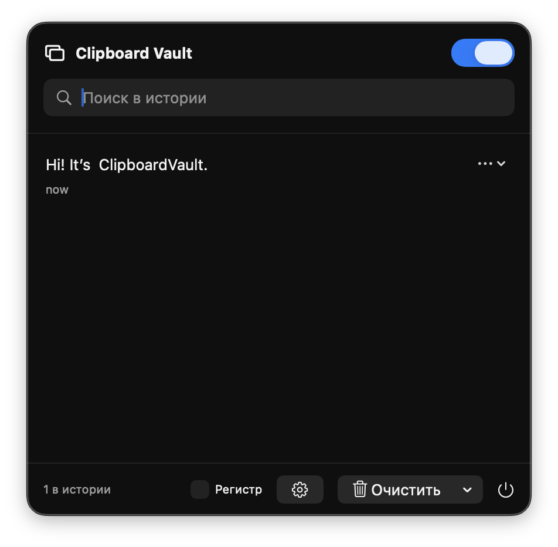

# Clipboard Vault

**Clipboard Vault** — нативный менеджер истории буфера обмена для macOS, написанный на SwiftUI. Он работает из строки меню, локально сохраняет скопированный текст и изображения, включая скриншоты, и позволяет быстро вернуть их в системный буфер.

## Интерфейс

> Окно истории открывается из Menu Bar или глобальной горячей клавишей `⌥⌘V`.

## Возможности версии 1.3

| Возможность | Поведение |
|---|---|
| Строка меню | Приложение работает из строки меню и не отображается в Dock; через него доступны история, настройки, очистка и выход. |
| Автозапуск | Пользователь может включить запуск Clipboard Vault при входе в macOS в разделе «Автозапуск». |
| Глобальная горячая клавиша | По умолчанию `⌥⌘V` открывает и скрывает окно истории поверх активного приложения. Сочетание можно изменить в настройках. |
| История текста | Сохраняет обычный текст из общего буфера обмена macOS. |
| История изображений | Сохраняет изображения и скриншоты как локальные PNG-файлы. |
| Миниатюры | Показывает превью изображения, его тип и размеры в пикселях. |
| Поиск | Фильтрует текстовые и графические записи истории. |
| Быстрое копирование | Нажатие на запись возвращает текст или PNG в системный буфер. |
| Избранное | Закреплённые записи сохраняются при обычной очистке истории. |
| Дедупликация | Одинаковый текст и одинаковые изображения не создают лишние записи. |
| Локальное хранение | JSON и PNG хранятся в `Application Support/ClipboardVault`. |
| Приватность | Сбор истории можно остановить в интерфейсе строки меню или настройках. |

## Скачать и установить

[**Скачать Clipboard Vault 1.3 для macOS (.dmg)**](releases/ClipboardVault-1.3-macOS.dmg)

Откройте DMG и перетащите `Clipboard Vault.app` в `Applications`. Текущая сборка не подписана и не нотарифицирована: при первом запуске используйте Control-click → «Открыть» либо разрешите приложение в системных настройках безопасности.

## Глобальная горячая клавиша

По умолчанию нажмите **⌥⌘V**, чтобы открыть окно истории Clipboard Vault из любого приложения; повторное нажатие скрывает его. В настройках Clipboard Vault в разделе **«Горячая клавиша»** нажмите на показанное сочетание и затем удерживайте один или несколько модификаторов (`⌃`, `⌥`, `⇧`, `⌘`) вместе с нужной клавишей. Если сочетание уже занято macOS или другим приложением, Clipboard Vault сохранит последнее рабочее значение и покажет сообщение об ошибке.

Обработчик использует нативную регистрацию одного сочетания клавиш и не требует разрешения Accessibility. Он не отслеживает остальные нажатия и не отправляет данные по сети.

## Автозапуск и Menu Bar

После первого запуска откройте значок Clipboard Vault в строке меню, нажмите кнопку с шестерёнкой и включите **«Запускать при входе в macOS»**. Автозапуск выключен по умолчанию и регистрируется только после явного действия пользователя. macOS может показать уведомление о добавлении объекта входа; его состояние также можно посмотреть или изменить через кнопку **«Открыть настройки объектов входа»**.

В Dock приложение не показывается. Для завершения работы откройте окно из строки меню и нажмите кнопку питания внизу справа.

## Где хранятся данные

История записей хранится в `Application Support/ClipboardVault/history.json`. Графические данные хранятся рядом в каталоге `Application Support/ClipboardVault/Images` в формате PNG. При сохранении истории приложение удаляет PNG-файлы, которые больше не связаны ни с одной записью.

## Приватность

Приложение не использует сетевые подключения и не отправляет содержимое буфера обмена на серверы. Изображения могут содержать конфиденциальные данные. Перед копированием одноразовых кодов, паролей и других чувствительных материалов выключайте сбор истории. Команда **Clear all history** полностью удаляет записи и связанные PNG-файлы.

## Границы версии 1.3

Поддерживаются обычный текст, изображения, автозапуск и настраиваемая глобальная горячая клавиша. Форматированный текст, документы, произвольные файлы, исключения для выбранных приложений и синхронизация с iCloud остаются за пределами текущей версии.

[View the full portfolio case →](https://artyomliske.ru/#case-clipboardvault)
